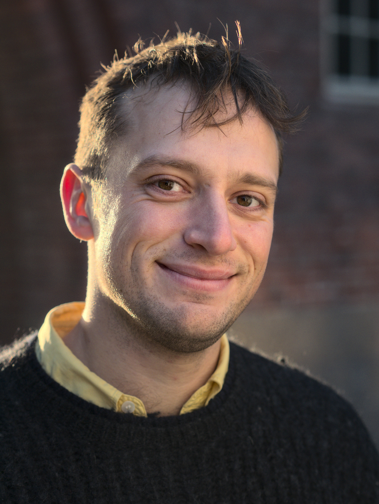

Ph.D. student working in the [Lagergren Lab](https://lagergrenlab.org/) at KTH, Stockholm. email: okviman@kth.se

### Research interests 

**Probabilistic machine learning**: My recent and current works involve, e.g., variational inference, variational auto-encoders, importance sampling, sequential Monte Carlo methods and Monte Carlo objective functions.

**Bayesian phylogenetics**: I research variational inference-based phylogenetics, tree sampling methods and joint inference of gene and species trees.

### Articles
- [Learning with MISELBO: The Mixture Cookbook](https://arxiv.org/abs/2209.15514), *arxiv* (with Ricky Molén, Alexandra Hotti, Semih Kurt, [Víctor Elvira](https://victorelvira.github.io/) and [Jens Lagergren](https://lagergrenlab.org/))
- [VaiPhy: a Variational Inference Based Algorithm for Phylogeny](https://arxiv.org/abs/2203.01121), *\[**Oral**\] NeurIPS 2022* (with Hazal Koptagel, [Harald Melin](https://haraldmelin.github.io/), Negar Safinianaini and [Jens Lagergren](https://lagergrenlab.org/))
- [Multiple Importance Sampling ELBO and Deep Ensembles of Variational Approximations](https://proceedings.mlr.press/v151/kviman22a.html), *AISTATS 2022* (with [Harald Melin](https://haraldmelin.github.io/), Hazal Koptagel, [Víctor Elvira](https://victorelvira.github.io/) and [Jens Lagergren](https://lagergrenlab.org/)) \[[5-min presentation](https://slideslive.com/38980790/multiple-importance-sampling-elbo-and-deep-ensembles-of-variational-approximations?ref=recommended)\]
#### Pre Ph.D. studies
- [KL/TV Reshuffling: Statistical Distance Based Offspring Selection in SMC Methods](http://kth.diva-portal.org/smash/record.jsf?aq2=%5B%5B%5D%5D&c=15&af=%5B%5D&searchType=LIST_LATEST&sortOrder2=title_sort_asc&query=&language=en&pid=diva2%3A1692964&aq=%5B%5B%5D%5D&sf=all&aqe=%5B%5D&sortOrder=author_sort_asc&onlyFullText=false&noOfRows=50&dswid=-4716), *Master Thesis 2020*
- [\[Re\] Tensor Monte Carlo: Particle Methods for the GPU Era](http://rescience.github.io/bibliography/Kviman_2020.html), *NeurIPS 2019 Reproducibility Challenge/ReScience-C Journal Publication* (with Linus Nilsson and Martin Larsson)
- [Sequence Disambiguation with Synaptic Traces in Associative Neural Networks](https://link.springer.com/chapter/10.1007/978-3-030-30487-4_61), *ICANN 2019* (with Ramon H. Martinez, Anders Lansner and Pawel Herman)

### Teaching at KTH
- [Statistical Methods in Applied Computer Science](https://www.kth.se/student/kurser/kurs/DD2447) (Lecturer; 2021-)
- [Machine Learning, Advanced Course](https://www.kth.se/student/kurser/kurs/DD2434?l=en) (TA; 2020-)
- [Deep Learning, Advanced Course](https://www.kth.se/student/kurser/kurs/DD2412?l=en) (TA; 2021-2022)
